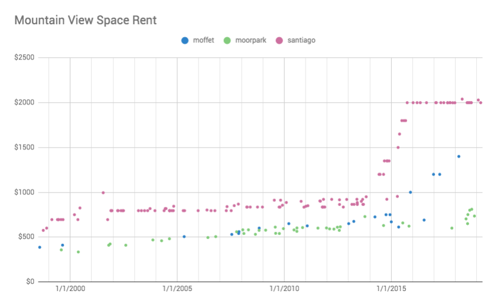
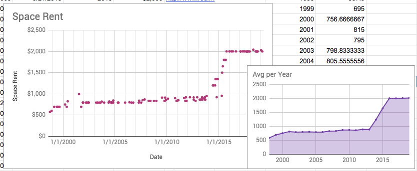
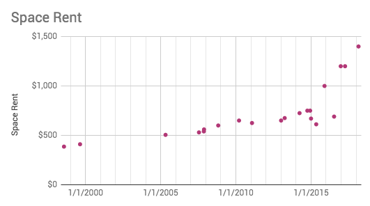
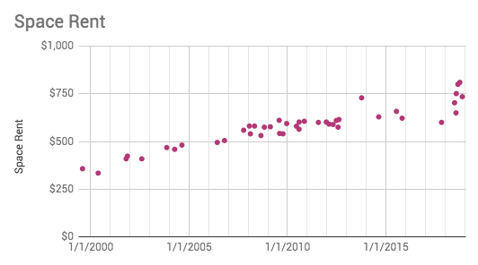

# Mobile Home Space Rents

This data set spans `20` years of data across `3` mobile home parks in Mountain View, CA.

It was collected from the space rent advertised by the listing agent when a home is sold on the open market.

My hope is this helps people make a more educated mobile-home decisions.

You can use this data however you'd like; for example, to create a spreadsheet [like this][2].

Here's a graph of all the data points for Mountain View:

You can also look at this on a per-park basis. Here's Santiago Villa:

Moffett:

Moorpark:

## Why is this important?

This is important because rent affects resale value.

> As a practical matter, mobile homes are immobile. They cannot be moved from one mobile home park to another because typically there are no vacant mobile home spaces within mobile home parks in the metropolitan area. Furthermore, the cost of moving mobile homes and setting them up in new mobile home spaces is very high relative to their value. As a practical matter, mobile home owners must sell their mobile homes “in-place” and persons who desire to move into mobile home parks must purchase existing mobile homes in order to move into a mobile home park.
> - https://www.codepublishing.com/CA/Fremont/html/Fremont09/Fremont0955.html

Increasing space rent (also called lot rent) makes mobile homes less valuable.

A space rent increase in $100/mo causes your home to [lose about $10,000][1] of value. This is because buyers focus on the monthly cost of ownership (mortgage + space rent).

If you need to move, your only realistic option as a homeowner is an in-place transfer. If space rent has gone up $1000 bucks, realizing your home has lost $100,000 of value is pretty startling.

## Contributing

Contributions welcome. Especially data from a new city or park. :)

[1]: https://mvmha.com/in-place-transfer/
[2]: https://docs.google.com/spreadsheets/d/1THy_opV52gCNo4E1thM7DSLqGFrc2oeWJzgCwn6ymGc/edit?usp=sharing

## License

[MIT](https://opensource.org/licenses/MIT)